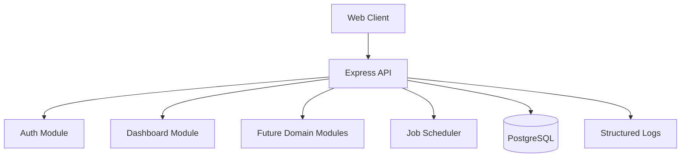
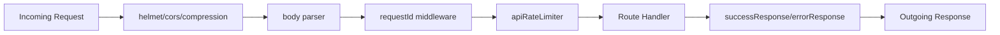
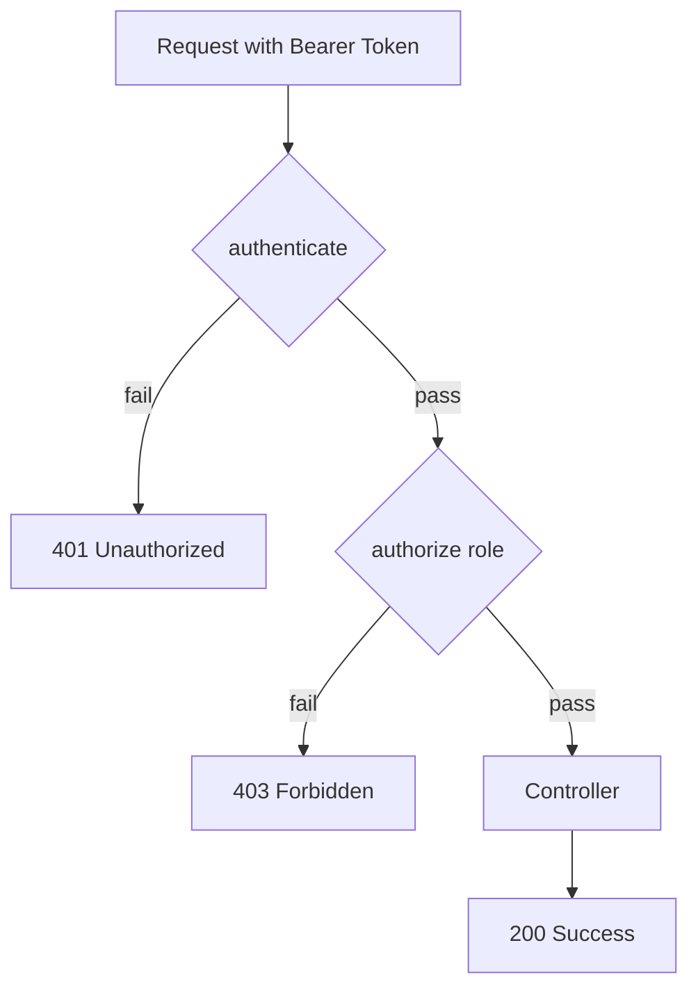
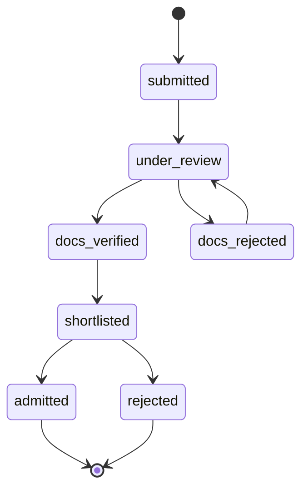
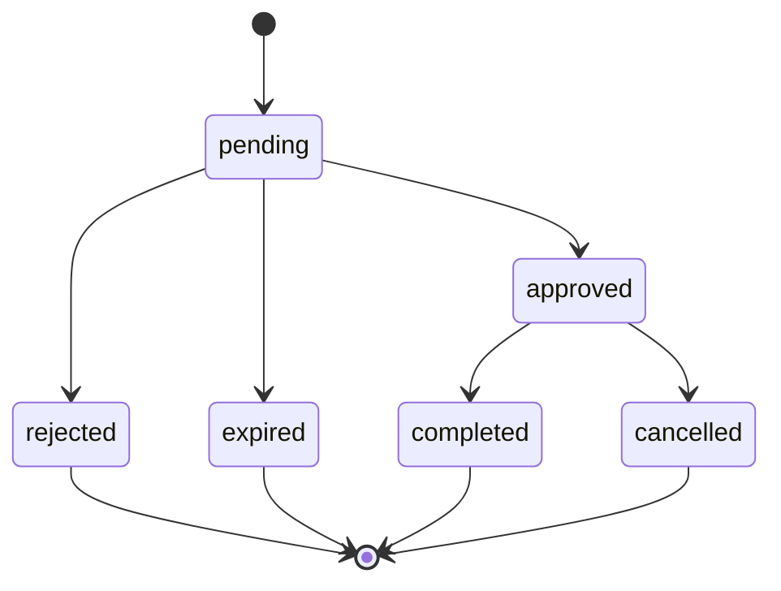
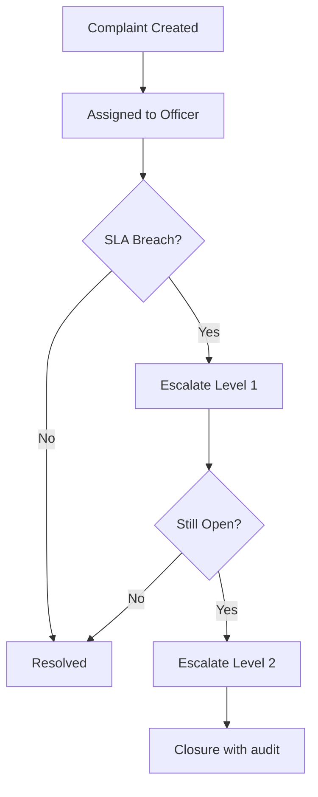
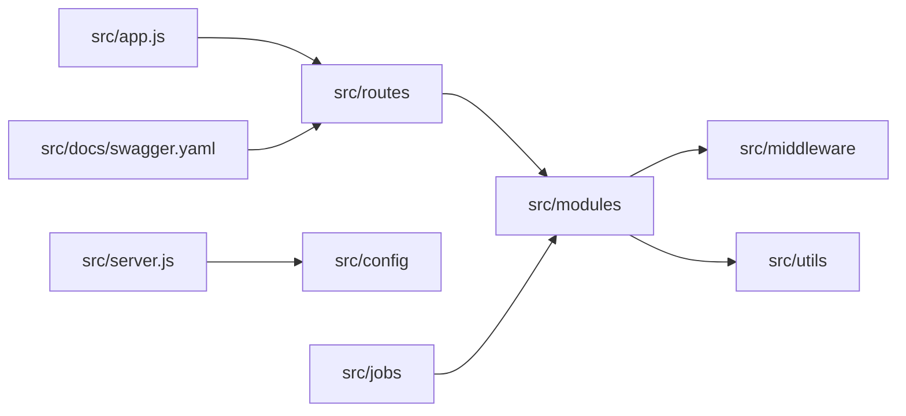
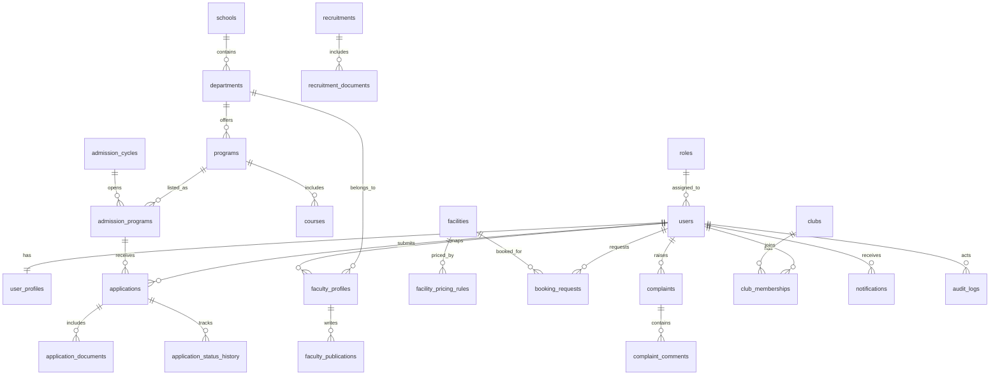

# GBU Website Backend Master Documentation

Single source of truth for the full GBU website backend.

## Current Implementation Snapshot (April 2026)

This repository includes a long-term target architecture and a partial live implementation.
To avoid confusion, use this quick snapshot first:

- Health check: `GET /api/health`
- Tenders API (live): `GET /api/v1/tenders`
- Recruitments API (live): `GET /recruitments`
- Academics/Departments/Programs: live under `GET /api/v1/...`
- Communications module: mounted under `GET /api/v1/...`
- Clubs backend module: live under `GET /api/clubs` and `GET /api/v1/clubs`

Database tables currently present for these newer modules:

- `tenders`
- `recruitments`
- `recruitment_documents`
- `clubs`

## Stack

- Runtime: Node.js
- Framework: Express.js
- Database: PostgreSQL
- ORM: Sequelize (recommended) or Prisma
- Auth: JWT + Refresh Token + RBAC
- API Style: REST (`/api/...`)

---

## 1) Objectives

Build a production-ready backend that supports all frontend areas:

- School / Department / Program hierarchy
- Admission + document verification workflows
- Faculty profiles + research datasets
- Resource booking + pricing
- Tenders + recruitments
- Announcements, events, media, newsletters
- Grievance portal with role-based dashboards
- Placement, research, clubs, NCC, NSS
- Directory, contact forms, static page CMS, global search

No module remains undefined after this document.

---

## 2) Backend Architecture

### 2.1 Suggested Folder Structure

```text
backend/
  src/
    app.js
    server.js
    config/
      env.js
      db.js
      logger.js
    constants/
      roles.js
    routes/
      index.js
    modules/
      auth/
      dashboard/
      users/
      cms/
      academics/
      admissions/
      faculty/
      departments/
      booking/
      tenders/
      recruitments/
      grievance/
      rti/
      clubs/
      ncc/
      nss/
      research/
      placements/
      directory/
      contact/
      search/
      media/
      notifications/
      audit/
    middleware/
      auth.js
      validate.js
      errorHandler.js
      rateLimit.js
      upload.js
    utils/
      pagination.js
      queryBuilder.js
      date.js
      response.js
    jobs/
      archiveTenders.job.js
      bookingReminder.job.js
      newsletter.job.js
    docs/
      swagger.yaml
```

### 2.2 Core Principles

- Modular, domain-based architecture
- Strict DTO validation at controller boundary
- Service layer for business logic
- Transactions for critical workflows (admission, booking, grievance)
- Soft delete where auditability is required
- Every write operation must produce audit logs

---

## 3) Roles & Access Matrix

Roles:

- `super_admin`
- `school`
- `faculty`
- `staff`
- `public` (no login)

### Access Summary

- `public`: read-only for events, notices, tenders, recruitments, faculty directory, schools
- `school`: school dashboard + school-level updates
- `staff` / `faculty`: workflow actions based on permissions
- `super_admin`: full CRUD, approvals, reports, user management

### Protected Dashboard Routes (Mandatory)

The following endpoints are protected and **cannot** be accessed until login is complete and role token is valid:

- `GET /api/dashboard/admin` → only `super_admin`
- `GET /api/dashboard/school` → only `school`
- `GET /api/dashboard/faculty` → only `faculty`

Authentication flow:

- Login: `POST /api/auth/login`
- Refresh: `POST /api/auth/refresh`
- Logout: `POST /api/auth/logout`
- Profile: `GET /api/auth/me`

Security enforcement:

- Middleware chain: `authenticate` → `authorize(role)`
- Unauthorized token: `401`
- Role mismatch: `403`
- Auth endpoints have stricter rate limiting

---

## 4) Frontend-to-Backend Module Mapping (Complete)

### A. Home + Global UI Content

- Frontend: `components/home/*`
- Module: `cms-home`
- Entities: `home_banners`, `home_sections`, `home_quick_links`, `home_stats`, `featured_items`
- APIs:
  - `GET /api/home`
  - `PUT /api/home` (`super_admin`)
  - `GET /api/quick-links`
  - `POST /api/quick-links` (`super_admin`)

### B. About University Pages

- Frontend: `pages/Aboutus/*`
- Module: `about-cms`
- Entities: `about_pages`, `governance_members`, `policy_documents`, `disclosures`, `leadership_profiles`
- APIs:
  - `GET /api/about/:slug`
  - `PUT /api/about/:slug` (`super_admin`)
  - `GET /api/governance`
  - `POST /api/governance` (`super_admin`)

### C. Academics, Schools, Departments, Programs

- Frontend: `pages/Academic/*`, `pages/departments/*`, `components/departments/*`
- Modules: `academics`, `departments`, `programs`
- Entities: `schools`, `departments`, `programs`, `courses`, `course_outcomes`, `department_contacts`, `department_notices`, `labs`, `boards_of_study`
- APIs:
  - `GET /api/v1/schools`
  - `GET /api/v1/schools/:id`
  - `GET /api/v1/departments`
  - `GET /api/v1/departments/:slug`
  - `GET /api/v1/programs?departmentId=`
  - `GET /api/v1/courses?programId=`
  - `POST /api/v1/departments` (`super_admin`)
  - `PUT /api/v1/departments/:id` (`super_admin`)
- Rules:
  - Unique department codes (e.g. `CSE`, `ECE`)
  - Syllabus versioning
  - Dynamic department blocks (`about`, `achievements`, `placements`, `labs`)

### D. Faculty Module (Detailed Tabs)

- Frontend: `components/faculty/*`, `pages/Academic/Faculty.jsx`, `FacultyDetail.jsx`
- Module: `faculty`
- Entities: `faculty_profiles`, `faculty_qualifications`, `faculty_teaching`, `faculty_publications`, `faculty_patents`, `faculty_talks`, `faculty_admin_roles`, `faculty_certifications`, `faculty_social_impact`, `faculty_research_groups`
- APIs:
  - `GET /api/faculty`
  - `GET /api/faculty/:id`
  - `GET /api/faculty/:id/publications`
  - `POST /api/faculty/:id/publications` (`faculty` / `super_admin`)
  - `PUT /api/faculty/:id/profile` (`faculty` / `super_admin`)
- Rules:
  - Faculty edits own profile only
  - `super_admin` edits all
  - Publications support DOI/URL, indexing, year filters

### E. Admissions Module

- Frontend: `pages/Admission/*`, `components/Admission/*`
- Module: `admissions`
- Entities: `admission_cycles`, `admission_programs`, `applications`, `application_documents`, `application_status_history`, `reservation_categories`, `eligibility_rules`
- APIs:
  - `GET /api/admissions/cycles/active`
  - `POST /api/admissions/applications`
  - `GET /api/admissions/applications/:id`
  - `GET /api/admissions/admin/applications`
  - `PUT /api/admissions/documents/:id/verify`
  - `PUT /api/admissions/applications/:id/status`
  - `GET /api/admissions/stats`
  - `GET /api/admissions/timeline`
- Rules:
  - No duplicate active application for same cycle + program
  - Mandatory docs vary by category
  - Controlled status transitions using FSM

### F. Booking + Resource Management

- Frontend: `pages/booking/BookingMain.jsx`, `components/booking/*`
- Module: `booking`
- Entities: `facilities`, `facility_images`, `facility_pricing_rules`, `facility_documents`, `booking_requests`, `booking_slots`, `booking_invoices`
- APIs:
  - `GET /api/facilities`
  - `GET /api/facilities/:id`
  - `GET /api/facilities/:id/pricing`
  - `GET /api/bookings/availability?facilityId=&from=&to=`
  - `POST /api/bookings/requests`
  - `PUT /api/bookings/requests/:id/approve`
  - `PUT /api/bookings/requests/:id/reject`
  - `GET /api/bookings/my`
- Rules:
  - Prevent slot overlap
  - Dynamic pricing by role + event type + duration
  - Auto-expire pending requests after timeout

### G. Announcements, Notices, News, Events

- Frontend: `pages/Announcements/*`, `components/announcement/*`
- Module: `communications`
- Entities: `announcements`, `news_items`, `events`, `event_tags`, `media_gallery_items`, `newsletter_issues`
- APIs:
  - `GET /api/v1/announcements`
  - `GET /api/v1/news`
  - `GET /api/v1/events`
  - `GET /api/v1/events/:id`
  - `GET /api/v1/events/:id/related`
  - `POST /api/v1/events` (`super_admin`)
  - `POST /api/v1/newsletters` (`super_admin`)
- Query features:
  - `search`, `category`, `dateFrom`, `dateTo`, `tags`
  - `page`, `limit`, `sortBy`, `order`

### H. Tenders Module

- Frontend: `pages/tenders/TenderMain.jsx`, `components/tenders/*`
- Module: `tenders`
- Entities (current): `tenders`
- APIs:
  - `GET /api/v1/tenders`
- Notes:
  - Returns one response payload with `items`, `current`, `archived`, and `meta`.
  - Query-param based filtering endpoints are intentionally not exposed in current live route.

### I. Recruitment Module

- Frontend: `pages/recruitments/RecruitMain.jsx`, `components/recruitments/*`
- Module: `recruitments`
- Entities (current): `recruitments`, `recruitment_documents`
- APIs:
  - `GET /recruitments`
- Notes:
  - Returns one response payload with `items`, `current`, `archived`, `currentByCategory`, `archivedByYear`, and `meta`.
  - This route is currently mounted directly (not under `/api/v1`).

### J. Grievance Portal (Role Dashboards)

- Frontend: `pages/grievance/*`, `components/Grievance/*`
- Module: `grievance`
- Entities: `complaints`, `complaint_assignments`, `complaint_comments`, `complaint_attachments`, `complaint_timeline`, `complaint_escalation_rules`, `feedback_ratings`
- APIs:
  - `POST /api/grievance/complaints`
  - `GET /api/grievance/complaints/me`
  - `GET /api/grievance/complaints/:id`
  - `PUT /api/grievance/complaints/:id/assign`
  - `PUT /api/grievance/complaints/:id/status`
  - `POST /api/grievance/complaints/:id/comments`
  - `GET /api/grievance/reports/super-admin`
- Rules:
  - SLA per category
  - Escalation on SLA breach
  - Mandatory timeline audit

### K. NCC / NSS / Clubs / Campus Life

- Frontend: `components/ncc/*`, `components/nss/*`, `components/clubs/*`, `pages/campusLife/*`, `pages/clubs/*`
- Modules: `clubs`, `ncc`, `nss`, `campus-life`
- Entities: `clubs`, `club_events`, `club_memberships`, `ncc_activities`, `nss_activities`, `campus_facilities`, `campus_content`, `campus_gallery`
- APIs:
  - `GET /api/clubs`
  - `GET /api/v1/clubs`
  - `GET /api/clubs/:id`
  - `GET /api/v1/clubs/:id`
  - `POST /api/clubs/:id/join`
  - `GET /api/ncc/events`
  - `GET /api/nss/events`
  - `POST /api/ncc/register`
  - `POST /api/nss/register`
  - `GET /api/campus-life/content/:slug`
- Current status note:
  - `clubs` read endpoints are implemented in runtime routes; join workflows remain planned.

### L. Research + IPR + Incubation + DAC

- Frontend: `pages/Reasearch/*`, `pages/dac/DAC.jsx`, `components/dac/*`
- Modules: `research`, `ipr`, `incubation`, `dac`
- Entities: `research_centers`, `funded_projects`, `research_publications`, `ipr_items`, `incubation_services`, `incubation_startups`, `dac_applications`
- APIs:
  - `GET /api/research/publications`
  - `GET /api/research/projects`
  - `GET /api/ipr`
  - `POST /api/dac/apply`

### M. Placement Module

- Frontend: `pages/Placement/*`
- Module: `placements`
- Entities: `placement_stats`, `recruiters`, `internship_programs`, `placement_brochures`, `training_programs`
- APIs:
  - `GET /api/placements/stats`
  - `GET /api/placements/recruiters`
  - `GET /api/placements/internships`

### N. Contact + Directory + Sitemap + Search

- Frontend: `pages/Contact/*`, `pages/directory/ContactDirectory.jsx`, `components/Searchbar/*`, `pages/Sitemap/*`
- Modules: `contact`, `directory`, `search`, `sitemap`
- Entities: `contact_messages`, `directory_entries`, `search_index`, `sitemap_routes`
- APIs:
  - `POST /api/contact/messages`
  - `GET /api/directory`
  - `GET /api/search?q=`
  - `GET /api/sitemap`

---

## 5) SQL Schema Baseline (Phase-1 Minimum)

- Identity: `users`, `roles`, `user_roles`, `refresh_tokens`
- Media: `media_files`, `media_folders`
- CMS: `pages`, `page_blocks`, `quick_links`, `banners`
- Academics: `schools`, `departments`, `programs`, `courses`
- Faculty: `faculty_profiles`, `faculty_publications`, `faculty_patents`
- Admission: `admission_cycles`, `applications`, `application_documents`, `application_status_history`
- Booking: `facilities`, `facility_pricing_rules`, `booking_requests`, `booking_slots`
- Communication: `announcements`, `news_items`, `events`
- Tender / Recruitment: `tenders`, `recruitments`, `recruitment_documents`
- Grievance: `complaints`, `complaint_timeline`, `complaint_comments`
- Clubs/NCC/NSS: `clubs`, `club_memberships`, `ncc_activities`, `nss_activities`
- Research/Placement: `research_publications`, `placement_stats`
- Ops: `audit_logs`, `notifications`, `system_settings`, `activities`

---

## 6) API Standards

### Headers

- `Authorization: Bearer <access_token>`
- `X-Request-Id: <uuid>`

### Success Response

```json
{
  "success": true,
  "message": "Fetched successfully",
  "data": {},
  "pagination": {
    "page": 1,
    "limit": 10,
    "total": 250,
    "pages": 25
  }
}
```

### Error Response

```json
{
  "success": false,
  "message": "Validation failed",
  "errors": [{ "field": "email", "message": "Email is invalid" }]
}
```

---

## 7) Non-Functional Requirements

- Security: Helmet, CORS allowlist, SQL injection prevention, request validation, rate limiting
- Performance: DB indexing, cache hot endpoints, response compression
- Reliability: transactions + retry-safe jobs
- Observability: structured logs + request IDs + error tracking
- Compliance: audit trail for all `super_admin` actions

---

## 8) File Upload & Media Rules

- Supported uploads:
  - PDF: tenders, notices, brochures, circulars
  - Images: events, faculty, gallery, clubs
  - Optional video links: virtual tour, media sections
- Rules:
  - Validate MIME + size
  - Store metadata in `media_files`
  - Use presigned URLs for cloud storage
  - Keep old versions for legal/compliance docs

---

## 9) Workflow Design (Critical Flows)

### 9.1 Admission Workflow

`Draft -> Submitted -> Docs Under Review -> Verified/Rejected -> Merit Listed -> Admitted`

- Every transition writes to `application_status_history`

### 9.2 Booking Workflow

`Requested -> Pending Approval -> Approved/Rejected -> Invoice Generated -> Completed`

- Overlap check mandatory before approval

### 9.3 Grievance Workflow

`Submitted -> Assigned -> In Progress -> Resolved -> Closed -> Feedback`

- SLA timer + escalation required

### 9.4 Tender Workflow

`Draft -> Published -> Corrigendum(optional) -> Closed -> Archived`

---

## 10) 4-Developer Work Distribution (No Gap)

### Developer 1: Platform, Auth, Users, Audit, RTI, Settings

- Project bootstrap + architecture
- Auth, RBAC, user lifecycle
- RTI, system settings, audit logs, admin base APIs
- Deliverables:
  - Refresh-token auth complete
  - User-role-permission management
  - Central middleware + error handling

### Developer 2: Academics, Departments, Faculty, Research, Placement

- Academic hierarchy
- Faculty full tab model + APIs
- Research + placement services
- Deliverables:
  - Schools/departments/program/course APIs
  - Faculty profile + nested tabs APIs
  - Research + placement APIs

### Developer 3: Admissions, Booking, Tenders, Recruitment

- Admission + doc verification + stats
- Booking conflict engine
- Tenders + job workflows
- Deliverables:
  - End-to-end admission APIs
  - Booking approvals + availability APIs
  - Tender + recruitment modules

### Developer 4: CMS, Communications, Grievance, Clubs/NCC/NSS, Contact/Search

- Home/About/Campus CMS
- Announcements/news/events/gallery/newsletter
- Grievance role dashboard backend
- Public modules
- Deliverables:
  - CMS editor APIs
  - Communication APIs with search/filter/pagination
  - Grievance workflow + reports
  - Contact/directory/search/sitemap APIs

---

## 11) Execution Plan (Sprint-wise)

- Sprint 1 (Foundation): repo setup, migrations, auth, RBAC, media service, shared utilities
- Sprint 2 (Core Business): academics, admissions, faculty, communications, tenders/recruitments
- Sprint 3 (Workflows & Dashboards): booking engine, grievance dashboards, research/placement
- Sprint 4 (Hardening): search, sitemap, security/performance audit, tests, docs freeze

---

## 12) Testing Strategy

- Unit: services + validators
- Integration: auth, admissions, booking, grievance
- Contract: critical public APIs
- Role tests: authorization matrix
- Data tests: migration consistency + rollback verification

### Must-have Test Scenarios

- Duplicate application is blocked
- Double booking is blocked
- Unauthorized admin endpoints are blocked
- Unauthorized super-admin endpoints are blocked
- Grievance escalation triggers on SLA breach

---

## 13) Documentation Deliverables

Per module:

- ERD snippet
- API list with request/response examples
- Validation rules
- Role permissions
- Edge-case behavior

Global:

- Postman collection
- Swagger/OpenAPI spec
- Seed data guide
- Deployment runbook

---

## 14) Definition of Done (Per Module)

A module is complete only when:

1. DB migrations and indexes merged
2. CRUD + workflow endpoints implemented
3. Auth + role checks verified
4. Validation + error handling present
5. Test cases pass
6. Swagger + Postman updated
7. Frontend integration behavior validated for super-admin/public visibility

---

## 15) Immediate Next Steps

1. Finalize ORM (`Sequelize` or `Prisma`)
2. Lock DB (`PostgreSQL` recommended)
3. Create migration baseline from section 5
4. Start Sprint 1 with Developer 1 lead
5. Run parallel implementation per ownership from section 10

---

## Suggested Project Bootstrap Commands

```bash
npm init -y
npm install express dotenv cors helmet compression jsonwebtoken bcrypt sequelize pg pg-hstore
npm install -D nodemon eslint prettier jest supertest
```

If Prisma is selected instead of Sequelize:

```bash
npm install prisma @prisma/client
npx prisma init
```

---

## Notes

- Keep all APIs under `/api`.
- Enforce request validation for every write endpoint.
- Implement audit logging for every state transition and admin write operation.
- Prefer idempotent job design for cron-based automations.

---

## 16) Current Repository Reality (As-Is State)

This section documents what is already implemented in the current repository so that every team member has a clear baseline before starting new module work.

### 16.1 Runtime and Startup

- Root entrypoint: `server.js` → delegates to `src/server.js`.
- `src/server.js`:
  - Loads app from `src/app.js`.
  - Reads config from `src/config/env.js`.
  - Calls `connectDb()` from `src/config/db.js`.
  - Starts Express listener on configured `PORT`.
  - Logs startup success or failure via `src/config/logger.js`.

### 16.2 App Middleware Chain

- `src/app.js` currently includes:
  - `helmet()`
  - `cors()`
  - `compression()`
  - `express.json()`
  - `express.urlencoded()`
  - request ID assignment with `X-Request-Id`
  - API level rate limiter
  - `/api` routes mount
  - notFound handler
  - global error handler

### 16.3 Implemented Route Groups

- `GET /api/health`
- `/api/auth/*`
  - `POST /api/auth/login`
  - `POST /api/auth/refresh`
  - `POST /api/auth/logout`
  - `GET /api/auth/me`
- `/api/dashboard/*`
  - `GET /api/dashboard/admin`
  - `GET /api/dashboard/school`
  - `GET /api/dashboard/faculty`

### 16.4 Implemented Security Components

- Authentication middleware: validates Bearer token.
- Authorization middleware: validates role against route requirements.
- API rate limit middleware and stricter auth rate limit middleware.

### 16.5 Implemented Utility Components

- Standardized success response helper.
- Standardized error response helper.
- Pagination helper.
- Query sort helper.
- Date helper.

### 16.6 Placeholder Components (Important)

- Database connector currently returns resolved promise (stub).
- Most domain module folders currently export empty object in `index.js`.
- Job files currently return `true` and are not wired to scheduler.
- Swagger file exists but paths are not yet defined.

---

## 17) Environment and Configuration Guide (Detailed)

### 17.1 Required Environment Variables

- `NODE_ENV`
  - Example: `development`, `staging`, `production`
  - Default in code: `development`
- `PORT`
  - Example: `4000`
  - Default in code: `4000`
- `JWT_ACCESS_SECRET`
  - Strong random secret for access token signing
- `JWT_REFRESH_SECRET`
  - Strong random secret for refresh token signing
- `JWT_ACCESS_EXPIRES_IN`
  - Example: `15m`
- `JWT_REFRESH_EXPIRES_IN`
  - Example: `7d`
- `CORS_ORIGIN`
  - Comma-separated allowed origins
  - Example: `http://localhost:5173,http://localhost:3000`

### 17.2 Example `.env` for Local Development

```env
NODE_ENV=development
PORT=4000
JWT_ACCESS_SECRET=replace-with-very-strong-value
JWT_REFRESH_SECRET=replace-with-very-strong-value
JWT_ACCESS_EXPIRES_IN=15m
JWT_REFRESH_EXPIRES_IN=7d
CORS_ORIGIN=http://localhost:5173
```

### 17.3 Example `.env` for Staging

```env
NODE_ENV=staging
PORT=8080
JWT_ACCESS_SECRET=staging-strong-access-secret
JWT_REFRESH_SECRET=staging-strong-refresh-secret
JWT_ACCESS_EXPIRES_IN=10m
JWT_REFRESH_EXPIRES_IN=3d
CORS_ORIGIN=https://staging-frontend.example.com
```

### 17.4 Example `.env` for Production

```env
NODE_ENV=production
PORT=8080
JWT_ACCESS_SECRET=prod-rotate-access-secret
JWT_REFRESH_SECRET=prod-rotate-refresh-secret
JWT_ACCESS_EXPIRES_IN=10m
JWT_REFRESH_EXPIRES_IN=7d
CORS_ORIGIN=https://www.example.com,https://admin.example.com
```

### 17.5 Configuration Validation Rules

- Never use default JWT secrets in shared environments.
- Keep access token expiry lower than refresh token expiry.
- Keep CORS origins explicit and minimal.
- Do not allow wildcard CORS in production.

---

## 18) API Contract Standards (Team-Wide)

### 18.1 Response Contract (Mandatory)

Success response:

```json
{
  "success": true,
  "message": "Human readable message",
  "data": {},
  "pagination": {
    "page": 1,
    "limit": 10,
    "total": 0,
    "pages": 1
  }
}
```

Error response:

```json
{
  "success": false,
  "message": "Validation failed",
  "errors": [
    {
      "field": "email",
      "message": "Email is required"
    }
  ]
}
```

### 18.2 HTTP Status Standard

- `200` success read/update action.
- `201` resource created.
- `204` delete without body.
- `400` validation failure.
- `401` authentication missing/invalid.
- `403` role does not have access.
- `404` resource or route not found.
- `409` conflict (duplicate/invalid state transition).
- `422` semantic validation errors (optional if used).
- `429` rate limit exceeded.
- `500` unhandled server error.

### 18.3 Request Validation Rules

- Validate all write requests.
- Validate all path params.
- Validate all query filters for type and value range.
- Return all validation errors together when possible.

### 18.4 Pagination Standard

- Query params:
  - `page`
  - `limit`
  - `sortBy`
  - `order`
- Maximum `limit` should be capped (recommended `100`).

### 18.5 Filtering Standard

- Public listing endpoints should support:
  - `search`
  - `status`
  - `dateFrom`
  - `dateTo`
  - `page`
  - `limit`
  - `sortBy`
  - `order`

---

## 19) Complete Module Blueprint (Detailed Execution Guide)

This section is a practical build guide for each module. It tells every developer what to create, what APIs to expose, and what validations to include.

### 19.1 `auth` Module

Purpose:

- Login and token lifecycle management.

Must-have files:

- `auth.routes.js`
- `auth.controller.js`
- `auth.service.js`
- `auth.validator.js` (recommended)

Must-have endpoints:

- `POST /api/auth/login`
- `POST /api/auth/refresh`
- `POST /api/auth/logout`
- `GET /api/auth/me`

Validation checklist:

- Email required and valid format.
- Password required and non-empty.
- Refresh token required for refresh/logout.

Security checklist:

- Hash stored passwords.
- Rotate refresh token strategy (recommended).
- Invalidate token on logout.
- Add login attempt logging.

### 19.2 `dashboard` Module

Purpose:

- Role-specific aggregate data for dashboards.

Must-have endpoints:

- `GET /api/dashboard/admin`
- `GET /api/dashboard/school`
- `GET /api/dashboard/faculty`

Validation checklist:

- All endpoints behind `authenticate`.
- Each endpoint behind strict `authorize(role)`.

Data checklist:

- Widget counts.
- Last activity summary.
- Pending approvals count.

### 19.3 `users` Module

Purpose:

- User directory, role assignment, profile lifecycle.

Must-have endpoints:

- `GET /api/users`
- `GET /api/users/:id`
- `POST /api/users`
- `PUT /api/users/:id`
- `PATCH /api/users/:id/status`
- `PATCH /api/users/:id/role`

Validation checklist:

- Unique email constraint.
- Role must be known role value.
- Status transitions allowed only by `super_admin`.

Data checklist:

- `users`
- `user_profiles`
- `user_role_history`

### 19.4 `cms` Module

Purpose:

- Static pages and home sections management.

Must-have endpoints:

- `GET /api/cms/pages/:slug`
- `PUT /api/cms/pages/:slug`
- `GET /api/cms/home`
- `PUT /api/cms/home`

Validation checklist:

- Slug uniqueness.
- Publish state validation.
- Versioning metadata.

Data checklist:

- `cms_pages`
- `cms_blocks`
- `cms_revisions`

### 19.5 `academics` Module

Purpose:

- School, department, program, and course structures.

Must-have endpoints:

- `GET /api/academics/schools`
- `GET /api/academics/schools/:id`
- `POST /api/academics/schools`
- `GET /api/academics/programs`
- `GET /api/academics/courses`

Validation checklist:

- Unique school code.
- Program linked to valid department.
- Course credit constraints.

Data checklist:

- `schools`
- `departments`
- `programs`
- `courses`
- `course_outcomes`

### 19.6 `departments` Module

Purpose:

- Department profile, contacts, notices, labs.

Must-have endpoints:

- `GET /api/departments`
- `GET /api/departments/:slug`
- `POST /api/departments`
- `PUT /api/departments/:id`

Validation checklist:

- Department code uniqueness.
- Slug uniqueness.
- School reference must exist.

Data checklist:

- `department_profiles`
- `department_contacts`
- `department_notices`
- `department_labs`

### 19.7 `admissions` Module

Purpose:

- Admission cycle, applications, document verification.

Must-have endpoints:

- `GET /api/admissions/cycles/active`
- `POST /api/admissions/applications`
- `GET /api/admissions/applications/:id`
- `PUT /api/admissions/documents/:id/verify`
- `PUT /api/admissions/applications/:id/status`

Validation checklist:

- Prevent duplicate active application for cycle+program+applicant.
- Document type mandatory by category.
- FSM status transition checks.

Data checklist:

- `admission_cycles`
- `admission_programs`
- `applications`
- `application_documents`
- `application_status_history`

### 19.8 `faculty` Module

Purpose:

- Faculty public profile and academic work records.

Must-have endpoints:

- `GET /api/faculty`
- `GET /api/faculty/:id`
- `PUT /api/faculty/:id/profile`
- `GET /api/faculty/:id/publications`
- `POST /api/faculty/:id/publications`

Validation checklist:

- Faculty can edit only own profile.
- DOI or URL validation for publications.
- Year range validation.

Data checklist:

- `faculty_profiles`
- `faculty_publications`
- `faculty_patents`
- `faculty_talks`
- `faculty_qualifications`

### 19.9 `booking` Module

Purpose:

- Facility booking and slot management.

Must-have endpoints:

- `GET /api/facilities`
- `GET /api/facilities/:id`
- `GET /api/bookings/availability`
- `POST /api/bookings/requests`
- `PUT /api/bookings/requests/:id/approve`
- `PUT /api/bookings/requests/:id/reject`

Validation checklist:

- No slot overlap.
- Duration max cap.
- Pricing rule validation.

Data checklist:

- `facilities`
- `facility_pricing_rules`
- `booking_requests`
- `booking_slots`
- `booking_invoices`

### 19.10 `tenders` Module

Purpose:

- Tender publishing and lifecycle.

Must-have endpoints:

- `GET /api/v1/tenders`

Validation checklist:

- Current implementation is read-focused and frontend-consumption ready.
- Response includes grouped sections (`items`, `current`, `archived`).

Data checklist:

- `tenders`

### 19.11 `recruitments` Module

Purpose:

- Job posts and candidate application workflow.

Must-have endpoints:

- `GET /recruitments`

Validation checklist:

- Current implementation is read-focused and frontend-consumption ready.
- Response includes grouped sections for active/archive and category/year views.

Data checklist:

- `recruitments`
- `recruitment_documents`

### 19.12 `grievance` Module

Purpose:

- Complaint lifecycle, assignment, escalation.

Must-have endpoints:

- `POST /api/grievance/complaints`
- `GET /api/grievance/complaints/me`
- `GET /api/grievance/complaints/:id`
- `PUT /api/grievance/complaints/:id/assign`
- `PUT /api/grievance/complaints/:id/status`
- `POST /api/grievance/complaints/:id/comments`

Validation checklist:

- Category required.
- SLA policy applied by category.
- Escalation if SLA breach.

Data checklist:

- `complaints`
- `complaint_assignments`
- `complaint_timeline`
- `complaint_comments`
- `complaint_attachments`

### 19.13 `rti` Module

Purpose:

- RTI records and downloadable disclosures.

Must-have endpoints:

- `GET /api/rti`
- `GET /api/rti/:id`
- `POST /api/rti`
- `PUT /api/rti/:id`

Validation checklist:

- Publish date and effective date checks.
- Document metadata required.

Data checklist:

- `rti_documents`
- `rti_categories`

### 19.14 `clubs` Module

Purpose:

- Club profiles, events, membership requests.

Current implementation status:

- Not implemented yet in backend runtime.
- `src/modules/clubs/index.js` is currently a placeholder.

Must-have endpoints:

- `GET /api/clubs`
- `GET /api/clubs/:id`
- `POST /api/clubs/:id/join`
- `GET /api/clubs/:id/events`

Validation checklist:

- One active membership per student per club.
- Event date and registration window checks.

Data checklist:

- `clubs`
- `club_events`
- `club_memberships`

### 19.15 `ncc` Module

Purpose:

- NCC activities and participant registrations.

Must-have endpoints:

- `GET /api/ncc/events`
- `POST /api/ncc/register`

Validation checklist:

- Event capacity checks.
- Duplicate registration prevention.

Data checklist:

- `ncc_events`
- `ncc_registrations`

### 19.16 `nss` Module

Purpose:

- NSS activities and participant registrations.

Must-have endpoints:

- `GET /api/nss/events`
- `POST /api/nss/register`

Validation checklist:

- Capacity checks.
- Duplicate registration prevention.

Data checklist:

- `nss_events`
- `nss_registrations`

### 19.17 `research` Module

Purpose:

- Research centers, funded projects, outputs.

Must-have endpoints:

- `GET /api/research/centers`
- `GET /api/research/projects`
- `POST /api/research/projects`

Validation checklist:

- Project funding dates.
- PI association validation.

Data checklist:

- `research_centers`
- `funded_projects`
- `research_outputs`

### 19.18 `placements` Module

Purpose:

- Placement stats, drives, company records.

Must-have endpoints:

- `GET /api/placements/stats`
- `GET /api/placements/drives`
- `POST /api/placements/drives`

Validation checklist:

- Salary and date format checks.
- Program/school mapping integrity.

Data checklist:

- `placement_drives`
- `placement_offers`
- `placement_reports`

### 19.19 `directory` Module

Purpose:

- Public searchable contact directory.

Must-have endpoints:

- `GET /api/directory`
- `GET /api/directory/:id`

Validation checklist:

- Contact visibility flags.
- Department mapping checks.

Data checklist:

- `directory_entries`

### 19.20 `contact` Module

Purpose:

- Contact-us forms and inquiry tracking.

Must-have endpoints:

- `POST /api/contact/submit`
- `GET /api/contact/admin/messages`

Validation checklist:

- Name, email, message required.
- Spam and flood control.

Data checklist:

- `contact_submissions`

### 19.21 `search` Module

Purpose:

- Unified global search API.

Must-have endpoints:

- `GET /api/search`

Validation checklist:

- Query length minimum.
- Page and limit validations.

Data checklist:

- Search index tables or adapters.

### 19.22 `media` Module

Purpose:

- Media uploads and gallery references.

Must-have endpoints:

- `POST /api/media/upload`
- `GET /api/media`
- `DELETE /api/media/:id`

Validation checklist:

- File type checks.
- File size checks.
- Access checks by role.

Data checklist:

- `media_assets`
- `media_folders`

### 19.23 `notifications` Module

Purpose:

- Notification dispatch and templates.

Must-have endpoints:

- `POST /api/notifications/send`
- `GET /api/notifications/templates`

Validation checklist:

- Template exists check.
- Recipient validation.

Data checklist:

- `notification_templates`
- `notification_logs`

### 19.24 `audit` Module

Purpose:

- Centralized audit trail for all critical writes.

Must-have endpoints:

- `GET /api/audit/logs`
- `GET /api/audit/logs/:id`

Validation checklist:

- Super admin only access.
- Filter validation.

Data checklist:

- `audit_logs`

### 19.25 `common` Module

Purpose:

- Shared reference APIs (enums, dropdown values).

Must-have endpoints:

- `GET /api/common/lookups`
- `GET /api/common/enums`

Validation checklist:

- Strict cache headers.

Data checklist:

- Static config / DB lookups.

---

## 20) Role-to-Endpoint Permission Matrix (Extended)

| Endpoint Group                        | public | school | faculty | staff | super_admin |
| ------------------------------------- | ------ | ------ | ------- | ----- | ----------- |
| `/api/health`                         | Allow  | Allow  | Allow   | Allow | Allow       |
| `/api/auth/login`                     | Allow  | Allow  | Allow   | Allow | Allow       |
| `/api/auth/refresh`                   | Allow  | Allow  | Allow   | Allow | Allow       |
| `/api/auth/logout`                    | Deny   | Allow  | Allow   | Allow | Allow       |
| `/api/auth/me`                        | Deny   | Allow  | Allow   | Allow | Allow       |
| `/api/dashboard/admin`                | Deny   | Deny   | Deny    | Deny  | Allow       |
| `/api/dashboard/school`               | Deny   | Allow  | Deny    | Deny  | Deny        |
| `/api/dashboard/faculty`              | Deny   | Deny   | Allow   | Deny  | Deny        |
| `/api/users/*`                        | Deny   | Deny   | Deny    | Deny  | Allow       |
| `/api/admissions/applications` create | Allow  | Allow  | Allow   | Allow | Allow       |
| `/api/admissions/admin/*`             | Deny   | Deny   | Deny    | Allow | Allow       |
| `/api/bookings/requests` create       | Allow  | Allow  | Allow   | Allow | Allow       |
| `/api/bookings/requests/*/approve`    | Deny   | Allow  | Deny    | Allow | Allow       |
| `/api/grievance/complaints` create    | Allow  | Allow  | Allow   | Allow | Allow       |
| `/api/grievance/reports/*`            | Deny   | Deny   | Deny    | Allow | Allow       |
| `/api/v1/tenders` read                | Allow  | Allow  | Allow   | Allow | Allow       |
| `/recruitments` read                  | Allow  | Allow  | Allow   | Allow | Allow       |

Notes:

- Actual route middleware decides final access.
- Matrix must be synced with implementation and tests.

---

## 21) Data Modeling Guidelines (Practical)

### 21.1 Naming Rules

- Table names: plural snake_case.
- Columns: snake_case.
- Foreign keys: `<entity>_id`.
- Timestamps: `created_at`, `updated_at`.

### 21.2 Base Columns for Most Tables

- `id` UUID or bigint.
- `created_at` timestamp.
- `updated_at` timestamp.
- `created_by` optional FK.
- `updated_by` optional FK.
- `is_deleted` boolean (if soft delete required).

### 21.3 Indexing Rules

- Add index on all frequent filter columns.
- Add composite index for frequent combined filters.
- Add unique constraints for business uniqueness.

### 21.4 Soft Delete Rules

- Do not physically delete auditable records.
- Use `is_deleted` + `deleted_at`.
- Exclude deleted records by default query scope.

### 21.5 Migration Rules

- Every migration must be reversible.
- Avoid destructive migration in one shot.
- Use backfill scripts for large data transitions.

---

## 22) Validation and Error Handling Guidelines

### 22.1 Validation Layer Strategy

- Perform schema validation in middleware.
- Perform business validation in service layer.
- Keep controllers thin.

### 22.2 Error Categories

- Validation errors (`400` / `422`).
- Authentication errors (`401`).
- Authorization errors (`403`).
- Conflict errors (`409`).
- Not found errors (`404`).
- Internal errors (`500`).

### 22.3 Error Payload Rules

- Always return `message`.
- Return field-level errors in array.
- Do not leak stack traces to clients.

### 22.4 Logging Rules

- Log all unhandled errors with request id.
- Log all authentication failures with safe metadata.
- Log all admin write actions.

---

## 23) Security Hardening Checklist

### 23.1 Authentication

- Use strong JWT secrets.
- Rotate secrets periodically.
- Invalidate refresh token on logout.

### 23.2 Authorization

- Apply `authorize()` middleware on every protected route.
- Prefer explicit role list on every route.
- Add tests for forbidden access.

### 23.3 API Surface

- Keep payload size limits strict.
- Apply route-level rate limits where needed.
- Validate all inputs.

### 23.4 Operational Security

- Use HTTPS in staging/production.
- Keep dependencies patched.
- Enable monitoring for suspicious spikes.

### 23.5 Data Protection

- Avoid logging sensitive fields.
- Encrypt sensitive data at rest when required.
- Restrict DB user permissions by environment.

---

## 24) Performance and Scalability Guidelines

### 24.1 API Performance

- Use pagination for all list endpoints.
- Select only required columns.
- Avoid N+1 query patterns.

### 24.2 Caching Strategy

- Cache public frequently-read responses.
- Use short TTL for dynamic content.
- Invalidate cache on update operations.

### 24.3 Database Performance

- Monitor slow query logs.
- Add targeted indexes.
- Use read replicas for heavy read patterns (future scale).

### 24.4 Job Performance

- Make jobs idempotent.
- Track job run metrics and durations.
- Add retry policy with backoff.

---

## 25) Scheduler and Background Job Design

### 25.1 Planned Jobs

- `archiveTenders.job.js`
  - Runs daily.
  - Archives expired tenders.
- `bookingReminder.job.js`
  - Runs hourly.
  - Sends reminders for upcoming bookings.
- `newsletter.job.js`
  - Runs on schedule.
  - Dispatches newsletter batches.

### 25.2 Job Metadata to Track

- `job_name`
- `started_at`
- `finished_at`
- `status`
- `records_processed`
- `error_message`

### 25.3 Job Failure Handling

- Retry transient failures.
- Alert on repeated failures.
- Maintain dead-letter queue for unrecoverable payloads.

---

## 26) API Documentation and Swagger Completion Plan

### 26.1 Current Status

- `src/docs/swagger.yaml` has only base metadata.

### 26.2 Required Additions

- Paths for all active endpoints.
- Request schemas.
- Response schemas.
- Security scheme for Bearer auth.
- Role notes in endpoint descriptions.

### 26.3 Documentation Workflow

1. Add endpoint implementation.
2. Add/Update swagger path and schema.
3. Add examples.
4. Validate with OpenAPI linter.
5. Publish docs preview.

---

## 27) Testing Blueprint (Expanded)

### 27.1 Unit Tests

- Service logic tests.
- Validation helper tests.
- Utility function tests.

### 27.2 Integration Tests

- Auth login/refresh/logout flow.
- Protected route access rules.
- Module workflow happy path.
- Module workflow failure path.

### 27.3 Contract Tests

- Response shape checks.
- Status code checks.
- Error payload checks.

### 27.4 Authorization Tests

- Role allowed scenarios.
- Role denied scenarios.
- Missing token scenarios.
- Invalid token scenarios.

### 27.5 Non-Functional Tests

- Basic load test for key endpoints.
- Rate limit behavior test.
- Recovery behavior after induced failure.

---

## 28) Team Development Workflow

### 28.1 Branching Model

- `main` for stable production-ready code.
- `develop` for integrated active work.
- `feature/<module>-<short-name>` for module feature work.
- `hotfix/<ticket>` for urgent fixes.

### 28.2 Commit Message Format

- `feat(module): add admissions application create API`
- `fix(auth): validate missing refresh token`
- `docs(readme): add module blueprint section`
- `test(booking): add overlap conflict test`

### 28.3 Pull Request Checklist

- Code compiles and runs.
- Validation added for all write inputs.
- Route protection added if required.
- Swagger updated.
- Tests added/updated.
- No secrets committed.

### 28.4 Code Review Checklist

- Naming consistency.
- Clear error handling.
- No dead code.
- No insecure patterns.
- Good test coverage for critical paths.

---

## 29) Deployment and Operations Runbook

### 29.1 Build and Start

- Install dependencies.
- Set environment variables.
- Run process manager in production.

### 29.2 Health Checks

- `GET /api/health` should return success.
- Check process uptime and memory.

### 29.3 Logs

- Capture stdout and stderr.
- Parse JSON logs for central monitoring.
- Search by request ID.

### 29.4 Rollback Strategy

- Keep previous stable deployment artifact.
- Rollback immediately on severe production errors.
- Record incident notes after rollback.

### 29.5 Incident Playbook

1. Acknowledge incident.
2. Capture scope and impact.
3. Mitigate with rollback or config patch.
4. Communicate status.
5. Perform root cause analysis.

---

## 30) Mermaid Diagrams (Expanded)

### 30.1 High-Level Service Architecture



### 30.2 Middleware Request Flow



### 30.3 Auth and RBAC Route Flow



### 30.4 Admission Workflow State Machine



### 30.5 Booking Request Lifecycle



### 30.6 Grievance Escalation Flow



### 30.7 Folder Dependency Diagram



---

## 31) Module Delivery Template (Use for Every New Module)

Copy this checklist for each module issue/ticket.

### 31.1 Planning

- Define business scope.
- Define roles and permissions.
- Define data entities.
- Define endpoint list.

### 31.2 Implementation

- Add route file.
- Add controller file.
- Add service file.
- Add validator file.
- Add repository/data access file if needed.

### 31.3 Security and Validation

- Add authenticate middleware where required.
- Add authorize middleware where required.
- Add request schema validation.
- Add business rule validation.

### 31.4 Documentation

- Add endpoint in README module section.
- Add path/schema in Swagger.
- Add request/response examples.

### 31.5 Testing

- Add unit tests.
- Add integration tests.
- Add authorization tests.

### 31.6 Release

- Merge after review.
- Deploy to staging.
- Verify with frontend team.
- Release to production.

---

## 32) Sample API Examples (Ready for Team Use)

### 32.1 Login Request

`POST /api/auth/login`

Request:

```json
{
  "email": "admin@gbu.ac.in",
  "password": "Admin@123"
}
```

Success response:

```json
{
  "success": true,
  "message": "Login successful",
  "data": {
    "user": {
      "id": 1,
      "name": "Super Admin",
      "email": "admin@gbu.ac.in",
      "role": "super_admin"
    },
    "accessToken": "<jwt>",
    "refreshToken": "<jwt>"
  }
}
```

### 32.2 Refresh Token Request

`POST /api/auth/refresh`

Request:

```json
{
  "refreshToken": "<jwt>"
}
```

Success response:

```json
{
  "success": true,
  "message": "Access token refreshed",
  "data": {
    "accessToken": "<jwt>"
  }
}
```

### 32.3 Dashboard Request (Admin)

`GET /api/dashboard/admin`

Headers:

```text
Authorization: Bearer <accessToken>
```

Success response:

```json
{
  "success": true,
  "message": "Admin dashboard data fetched",
  "data": {
    "dashboard": "admin",
    "role": "super_admin",
    "widgets": ["user-management", "audit-logs", "system-settings", "reports"]
  }
}
```

### 32.4 Validation Error Example

```json
{
  "success": false,
  "message": "Validation failed",
  "errors": [
    {
      "field": "email",
      "message": "Email is required"
    },
    {
      "field": "password",
      "message": "Password is required"
    }
  ]
}
```

### 32.5 Forbidden Error Example

```json
{
  "success": false,
  "message": "Forbidden",
  "errors": [
    {
      "field": "role",
      "message": "You do not have permission for this route"
    }
  ]
}
```

---

## 33) Production Readiness Checklist

### 33.1 Configuration

- Production env values configured.
- No default secrets used.
- CORS only trusted domains.

### 33.2 Security

- Rate limit active.
- Helmet active.
- Auth and RBAC enforced.
- Sensitive logs masked.

### 33.3 Observability

- Structured logs collected.
- Error alerts configured.
- Health endpoint monitored.

### 33.4 Reliability

- DB backups enabled.
- Rollback plan tested.
- Critical jobs monitored.

### 33.5 Documentation

- Swagger up to date.
- README up to date.
- Runbook approved.

---

## 34) Handover Notes for New Developers

### 34.1 First-Day Setup

1. Clone repository.
2. Create `.env` from template.
3. Run `npm install`.
4. Run `npm run dev`.
5. Verify `GET /api/health`.

### 34.2 First Code Task Recommendation

1. Pick one placeholder module.
2. Add route/controller/service skeleton.
3. Add one read endpoint.
4. Add one write endpoint with validation.
5. Add tests and docs.

### 34.3 Important Coding Rules

- Keep controller light.
- Keep business logic in service.
- Keep response shape consistent.
- Keep role checks explicit.

---

## 35) Final Summary

This README now has two layers together:

- Original master planning content (preserved).
- Expanded execution-grade team documentation (added).

With this combined documentation, team members can:

- Understand current implementation quickly.
- Build pending modules with clear standards.
- Follow consistent API contracts.
- Maintain security and quality across releases.

---

## 36) PostgreSQL Integration (Implemented in Code)

PostgreSQL connection is now configured in application code using environment variables.

### 36.1 What is implemented

- `src/config/env.js`
  - Added `DATABASE_URL` support.
  - Added `DB_SSL_ENABLED` support.
- `src/config/db.js`
  - Uses `pg` pool.
  - Validates `DATABASE_URL` is present.
  - Runs startup health check query (`SELECT 1`).
  - Exposes reusable helpers: `query`, `getDbPool`, `closeDb`.
- `.env.example`
  - Added DB configuration template.
- `src/db/schema.sql`
  - Added relational schema with foreign keys, constraints, and indexes.

### 36.2 Important security rule

- Do not hardcode DB URL in source files.
- Keep actual DB URL only in local/secure `.env`.

### 36.3 `.env` configuration example

```env
DATABASE_URL=postgresql://<db_user>:<db_password>@<db_host>/<db_name>?sslmode=require&channel_binding=require
DB_SSL_ENABLED=true
```

### 36.4 Apply schema to PostgreSQL

Use `psql` command from project root:

```bash
psql "$DATABASE_URL" -f src/db/schema.sql
```

If `DATABASE_URL` is inside `.env`, export it first in terminal:

```bash
export $(grep -v '^#' .env | xargs)
psql "$DATABASE_URL" -f src/db/schema.sql
```

### 36.5 Relation map (core entities)



### 36.6 Schema design highlights

- All major tables use UUID primary keys.
- Foreign keys are added for referential integrity.
- Business constraints are defined with unique keys and checks.
- Frequently filtered columns are indexed.
- Roles are seeded (`super_admin`, `school`, `faculty`, `staff`).
